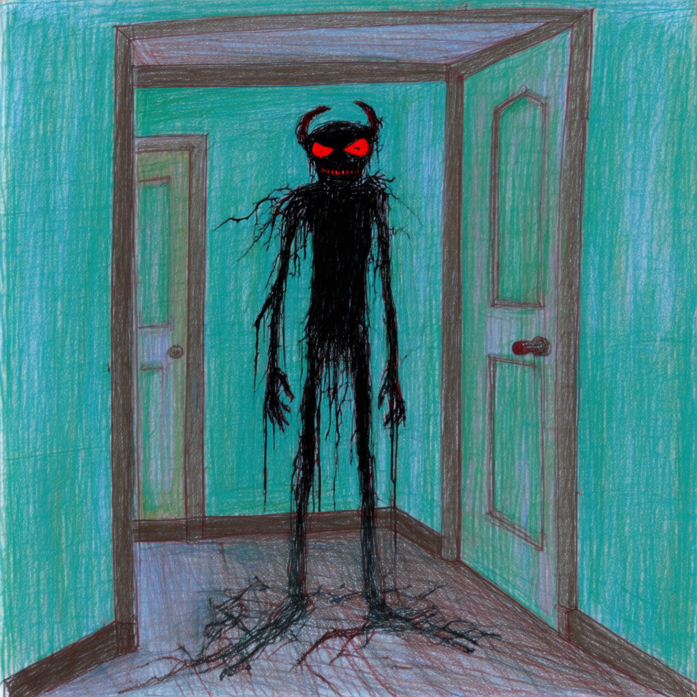

# pytorch_project

Self-contained SD3.5 + HyCoCLIP adapter workspace.

## 1) Environment

```bash
source your_environment
```

## 2) Configure Paths

Edit `paths_config.py`:
- `FLICKR30K_ROOT`
- `SD35_MODEL_PATH`
- `ADAPTER_SD35_PATH`

Defaults expected in project root:
- `hycoclip_vit_s.pth` (HyCoCLIP checkpoint)
- `adapter_SD35_fulldim.pth` (adapter checkpoint)

## 3) Train Adapter

(Skip HyCo embeddings build:)

```bash
python train_adapter_sd35.py --build-hyco false
```

Main outputs (project root):
- `sd35_clip_fulldim.pt`
- `adapter_SD35_fulldim.pth`

## 4) Generate with SD3.5 with or without Adapter

Adapter generation:

```bash
python SD35.py \
  --prompt "a cat wearing sunglasses" \
  --output_dir ./outputs \
  --steer True
```

Single prompt (vanilla SD3.5):

```bash
python SD35.py \
  --prompt "a cat wearing sunglasses" \
  --output_dir ./outputs \
  --steer False
```

## 5) Example Output




## 6) Lightning Version (`SD35_lightning.py`)

This folder also includes a PyTorch Lightning pipeline:
- `train` for adapter training
- `generate` for one-prompt inference

If Lightning is missing in your env, install one of:

```bash
pip install lightning
```

or

```bash
pip install pytorch-lightning
```

Training:

```bash
python SD35_lightning.py train
```

Generation with adapter:

```bash
python SD35_lightning.py generate \
  --prompt "a cat wearing sunglasses" \
  --output_dir ./outputs \
  --steer true
```

Generation vanilla:

```bash
python SD35_lightning.py generate \
  --prompt "a cat wearing sunglasses" \
  --output_dir ./outputs \
  --steer false
```
